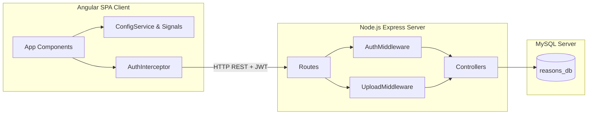

# Guía del Desarrollador: Portal Institucional REASONS

Esta guía detalla la arquitectura de software, las decisiones de diseño técnico, la estructura del código y los flujos del sistema del Portal Web REASONS. Está orientada a programadores encargados del mantenimiento, extensión y optimización del portal.

---

## 1. Arquitectura General del Sistema

El portal está estructurado bajo un modelo desacoplado **Full Stack**:



---

## 2. Base de Datos (Modelo Relacional)

La base de datos se implementa en **MySQL** (`reasons_db`) y su esquema físico se encuentra definido en [database_schema.sql](file:///c:/Users/johan/OneDrive/Documentos/Universidad/Web%20y%20Moviles/Ape03/docs/database_schema.sql).

### 2.1. Estructura de Tablas Principales
* **`site_settings`**: Almacena textos principales, colores institucionales en formato HEX, rutas de logotipo, imágenes de propósito y colaboración.
* **`specific_objectives`** y **`research_lines`**: Tablas asociadas a la configuración general mediante relaciones `FOREIGN KEY` con cascada en eliminación (`ON DELETE CASCADE`).
* **`hero_slides`**: Almacena las imágenes y textos del carrusel de inicio.
* **`researchers`**, **`projects`** y **`publications`**: Catálogos base de información del grupo.
* **`contact_messages`**: Registro de mensajes recibidos.
* **`users`**: Administradores del panel privado con hashes de contraseña encriptados.

### 2.2. Relaciones Muchos a Muchos
Para evitar inconsistencias y duplicidad de registros, se diseñaron tablas intermedias que implementan relaciones de cardinalidad $N:M$:
1. **`project_researchers`**: Vincula proyectos con sus investigadores coautores y define su rol específico dentro de dicho proyecto.
2. **`publication_authors`**: Vincula publicaciones con sus autores del grupo, ordenándolos según su jerarquía de autoría.

---

## 3. Frontend Angular: Decisiones de Diseño

El frontend está desarrollado en **Angular 17+ (Standalone)** e implementa principios modernos de reactividad y accesibilidad.

### 3.1. Estado y Reactividad mediante Angular Signals
Se evitan las suscripciones redundantes manuales de RxJS mediante el uso de **Signals** para el manejo del estado local y reactivo:
* **`ConfigService`**: Inyecta y mantiene la señal global `settings` que almacena toda la configuración del portal. Componentes como `HomeComponent` leen directamente de señales computadas (`logoUrl`, `purposeImageUrl`, `ctaImageUrl`), asegurando que cualquier actualización en el panel de administración se propague en milisegundos en toda la aplicación.
* **Refactorización de Archivos**: Los estados de subida de imágenes en `AdminSettingsComponent` (`selectedLogoFile`, `selectedPurposeFile`, etc.) se manejan como señales reactivas. Esto resuelve problemas de asincronía causados por la compresión local de imágenes, forzando a Angular a renderizar de inmediato los botones de confirmación de subida al seleccionar un archivo.

### 3.2. Temas Dinámicos de Colores
En lugar de compilar hojas de estilo rígidas, `ConfigService` descarga los colores hexadecimales configurados por el administrador en MySQL y altera dinámicamente las propiedades de estilo CSS del documento raíz (`:root`):
```typescript
private applyDynamicColors(data: SiteSettings): void {
  const root = document.documentElement;
  root.style.setProperty('--color-primary', data.primary_color);
  root.style.setProperty('--color-secondary', data.secondary_color);
  root.style.setProperty('--color-accent', data.accent_color);
  root.style.setProperty('--color-primary-hover', this.adjustColorBrightness(data.primary_color, -20));
  root.style.setProperty('--color-primary-light', this.adjustColorBrightness(data.primary_color, 210));
}
```
Tailwind CSS lee estas variables CSS dinámicas (configuradas en `tailwind.config.js`), permitiendo cambiar la identidad visual de todo el sitio en caliente.

### 3.3. Sistema de Accesibilidad Universal
Implementado en `PublicLayoutComponent`, gestiona de manera local los controles de accesibilidad. Inyecta clases específicas en el elemento `body` del documento (`high-contrast`, `dyslexic-font`, `reduce-motion`, `highlight-links`) y ajusta la escala del texto (`fontSize` de `html` a `14px`, `16px` o `19px`). El estado se persiste automáticamente en `localStorage` bajo la clave `reasons_accessibility`.

### 3.4. Control de Sesión Activa
Para mejorar la experiencia del usuario, el botón **Portal Administrador** en `public-layout.ts` evalúa el estado de inicio de sesión utilizando `auth.isAuthenticated()`. Si el token existe y es válido, redirige directamente al panel de control (`/admin/dashboard`). Si el usuario navega manualmente a `/admin/login` con sesión activa, el componente `LoginComponent` lo intercepta en su `ngOnInit()` y realiza una redirección automática.

---

## 4. Backend REST API: Estructura y Seguridad

El backend está desarrollado en **Node.js con Express**, conectado a MySQL mediante el pool optimizado en [db.js](file:///c:/Users/johan/OneDrive/Documentos/Universidad/Web%20y%20Moviles/Ape03/backend/src/config/db.js).

### 4.1. Carga Segura de Archivos (Multer)
Se implementa un middleware de carga seguro con `multer` configurado en `/backend/src/middleware/upload.js` que limita el tamaño máximo de los archivos a 5MB y valida tipos MIME estrictos para imágenes.
* **Eliminación de Huérfanos**: Al actualizar o borrar investigadores, proyectos, publicaciones o diapositivas del carrusel, los controladores ejecutan de forma atómica la eliminación del archivo anterior del disco físico utilizando `fs.unlinkSync()` para evitar saturar el almacenamiento del servidor con archivos basura.

### 4.2. Capas de Seguridad Activa
* **Helmet**: Agrega encabezados HTTP de protección frente a ataques comunes.
* **Content Security Policy (CSP)**: Personalizado en `app.js` para permitir la inyección y ejecución segura de scripts y estilos en línea de Swagger UI (`'unsafe-inline'`), resolviendo el error de carga de estilos e inicialización interactiva en `/api-docs`.
* **CORS**: Configurado con directivas restrictivas para limitar el consumo de la API REST únicamente al origen del cliente Angular.
* **Rate Limiting**: El middleware `express-rate-limit` restringe los intentos de inicio de sesión (`/api/auth/login`) y de contacto (`/api/contact`) a un máximo de 5 intentos por IP cada 15 minutos, mitigando ataques de fuerza bruta y denegación de servicio.
* **Validación y Sanitización**: Se utiliza `express-validator` en las rutas para sanitizar entradas textuales (evitando inyecciones XSS y ataques de inyección SQL) y validar formatos de correos electrónicos y códigos HEX.

### 4.3. Documentación OpenAPI 3.0 (Swagger)
Toda la API REST está documentada de forma explícita y completa en el archivo [swagger.js](file:///c:/Users/johan/OneDrive/Documentos/Universidad/Web%20y%20Moviles/Ape03/backend/src/config/swagger.js). La documentación interactiva puede probarse localmente accediendo a la ruta `/api-docs` y utilizando el botón **Authorize** superior derecho (formato `Bearer <token>`) para probar los endpoints privados.
